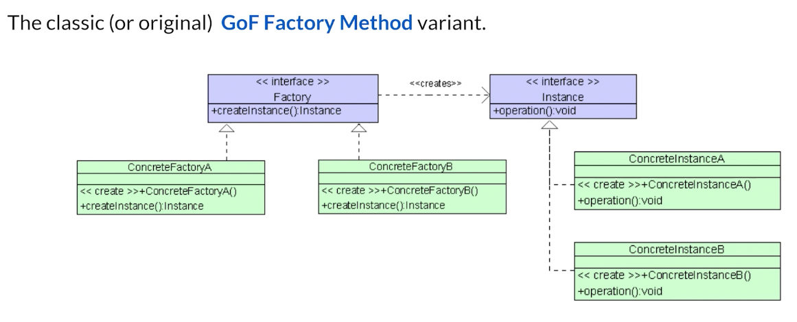
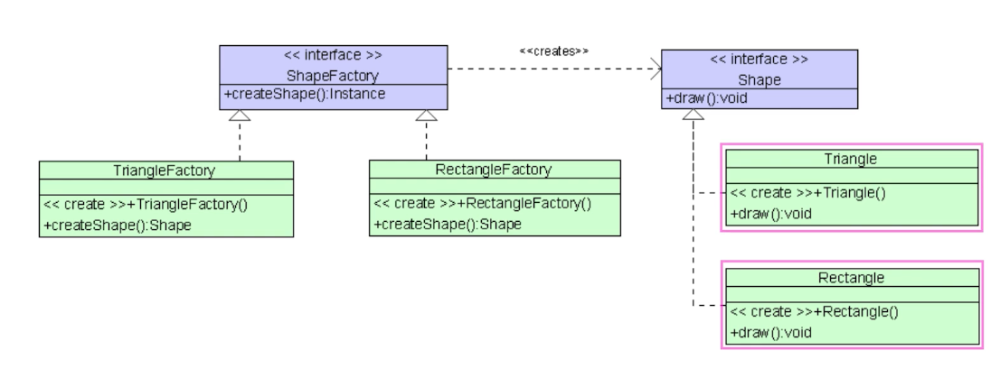
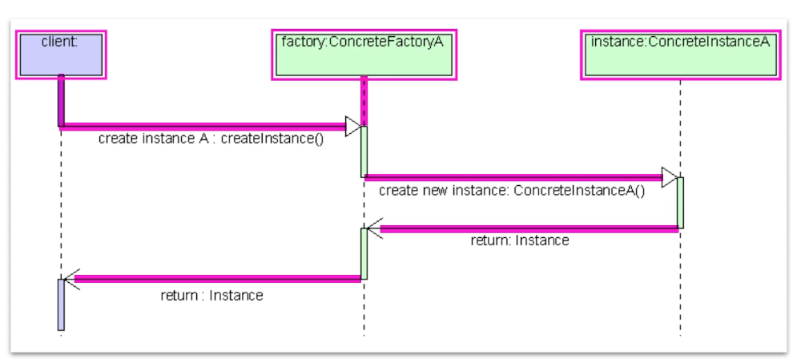
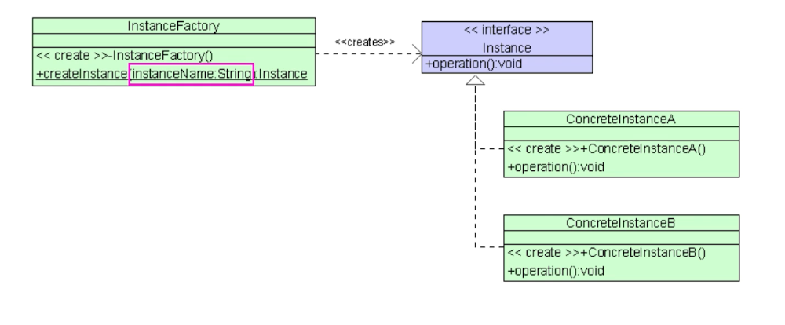
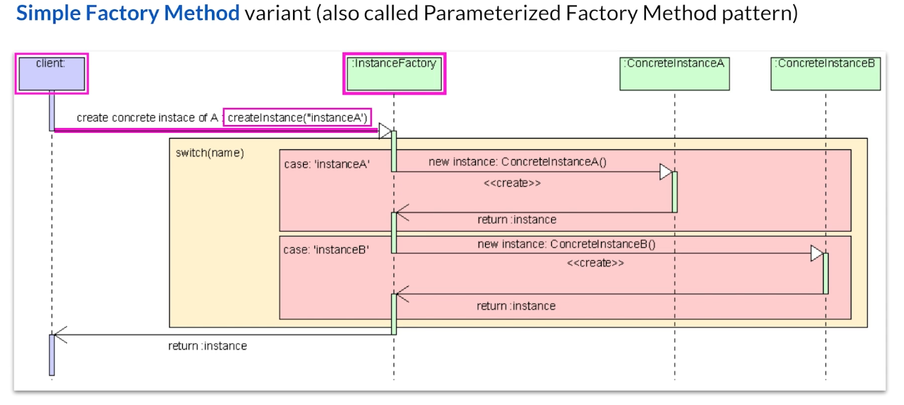
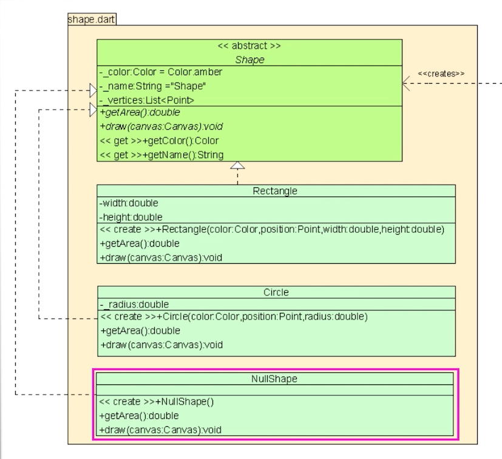
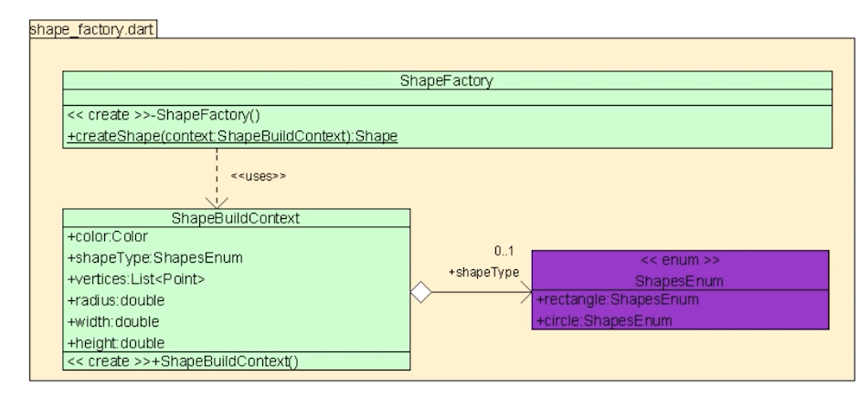

# Factory Pattern

일반적으로 사용되는 constructor
`Rectangle rect = Rectangle()`
굉장히 많이 쓰지만 이 패턴은 큰 단점이 있다.
인스턴스화를 위해 정확한 class type을 알아야 한다는 것이다.

왜냐면 새로운 타입들이 사용될수 있기 때문이다.

```
FastBullet fb = FastBullet();
SlowBullet sb = SlowBullet();
```

코드 자체에 타입과 연관성이 너무 강하게 있어서 새로운 타입이 생길때마다 코드를 변경해줘야한다는 단점이다.

Factory Method는 Creational Design Pattern으로 생성 타입에 대한 로직을 추상화 시켜준다.

1. 오브젝트는 constructor 대신 factory method로 만들어진다..
2. 오브젝트는 concretion대신 abstraction으로 만들어진다.

생성 로직을 호출자에게 노출하지 않는다. 호출자는 인터페이스를 통해서 새로운 오브젝트에 접근한다.

총알을 abstract class로 하고 나머지들은 상속하게 하자.

```
Bullet myBullet001 = BulletFactory.create(Bullet.FAST_BULLET);
Bullet myBullet002 = BulletFactory.create(Bullet.SLOW_BULLET);
```

호출자는 factory의 로직에 대해서 알지 못한다. 오로지 `.create`로 불러야된다는것과 `Bullet.TYPE`을 넣어줘야한다는것만 안다.
context data를 써서 더 제너릭하게 만들수도 있다.

```
BulletBuildContext context = //initialization data
Bullet myBullet003 = BulletFactory.create(context)
```

추가로 오브젝트를 캐시할 수 있다.
호출자는 캐시여부를 전혀 알 수 없다.

Define an interface for creating an object, but let subclasses decide which class to instantiate.

다음과 같은 패턴들과 잘 어울린다.

- Strategy, Iterator와 함께 써서 collection subclass들이 다양한 iterator를 리턴하게 하여 컬렉션과 함께 쓰일수있게 한다.
- Object Pool과 함께해서 다양한 subtype을 가진 캐시오브젝트들을 만든다.

언제 쓸것인가?

- 호출자가 생성되는 오브젝트의 클래스를 예측하지 못할때
  - 사용자가 무슨 무기를 쓸것인가? 아직 알 수 없다.
  - 추후에 새로운 탈 것과 무기들이 추가될수 있는데 코드변경은 안하고 싶다.
- 상속받은 클래스들이 많을때

장점

- sub class가 타입을 결정하게 해준다.
- Builder 패턴보다 구현이 쉽다.
- loose-coupling을 가능케 해준다.
- SRP에 해당한다
- Open/Closed Principle에도 해당한다. 왜냐면 신규 클래스를 추가할때 변경이 없으니까. 클린코드-

단점

- 클래스 자체가 많아진다.

고려사항

- 자식이 많은 타입이 있는 경우 공통의 인터페이스 혹은 추상 클래스에서 상속을 받게 한다.
- 부모클래스에 모든 자식들에 해당하는 메소드들이 있어야한다.
- static한 Factory를 만들어서 항상 같은 인터페이스에 대한 reference를 갖고오게 한다.
- factory한테 원하는 타입을 알려준다. 주로 enum을 사용한다.

종류

- Simple
- Classic(GoF)

### Classic Factory Pattern







- 각각의 클래스에 대해서 factory implementation이 존재한다.

```dart
Instance instanceA = ConcreteFactoryA().createInstance();
Instance instanceB = ConcreteFactoryB().createInstance();
```


### Simple Factory





- Factory는 하나만 존재한다. 대신에 만들고자하는 타입을 전달해준다.

```dart
Instance instanceA = InstanceFactory.createInstance(InstanceEnum.InstanceA)
Instance instanceB = InstanceFactory.createInstance(InstanceEnum.InstanceB)
```

- Factory가 하나만 있어서 편하다.


## Project Code





- ShapeBuildContext라는 클래스를 만들어서 ShapeFactory에 들어갈 인자값들에 대한 모델링을 해준다.
- 이중에서 Shape에 관한것은 enum으로 만들어서 관리해준다. 
- utils.dart에서 실행한다.


